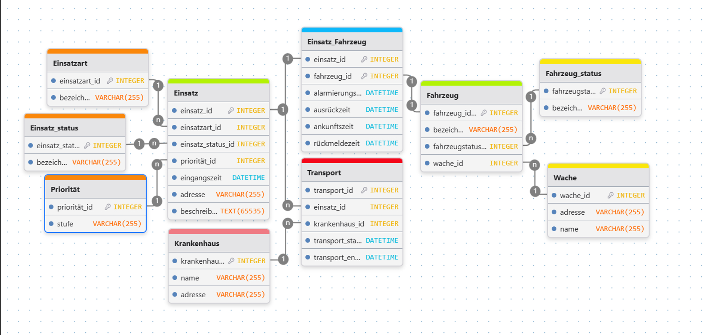

# Rettungsleitstelle Database

## Overview
Relational database for managing emergency incidents, vehicles, and transports.

The system is designed to store operational data in a structured way and support analytical queries.

---

## Goal
- structure emergency dispatch data
- ensure data integrity
- enable time-based and operational analysis

---

## Data Model

The database is based on a relational model with normalization up to **3NF** to avoid redundancy.

### Core entities:
- **Einsatz** – emergency incident (time, location, priority, status)
- **Fahrzeug** – vehicle assigned to a station
- **Einsatz_Fahrzeug** – m:n relationship with timeline (alarm → arrival → completion)
- **Transport** – patient transport to hospital

### Additional entities:
- Krankenhaus, Wache
- Einsatzart, Prioritat, Einsatz_status
- Fahrzeug_status

---

## Key Design Decisions

- Separation of master data and operational data → better maintainability
- Use of **foreign keys** to enforce relationships  
- **Transport modeled as a separate entity** to support multiple transports per incident and avoid NULL values
- Data prepared with realistic timestamps for analysis  

---

## ER Diagram



---

## Example Analysis

The database supports analytical queries such as:

- number of incidents over time  
- incidents without hospital transport  
- workload of stations  
- average response time by priority  
- identification of high-load incidents (duration + number of vehicles)

---

## Tech Stack
- MySQL
- SQL (DDL, DML, analytical queries)

---

## How to Run

```
1. Run schema.sql
2. Run data.sql
3. Run analysis.sql
```

---

## Access Model

The system includes role-based access:

- Admin – full access
- Disponent – manage incidents
- Auswerter – read & analyze data
- Gast – read-only access

---

## Conclusion
The database provides a clean, extensible structure for managing emergency operations and enables reliable analytical evaluation.

---

## Project Structure
```
rettungsleitstelle-db/
│
├── schema.sql # database schema (tables, constraints, roles)
├── data.sql # sample data for testing
├── analysis.sql # analytical SQL queries
├── README.md
└── docs/
    └── ER-Modell_Einsatzverwaltung.png
```